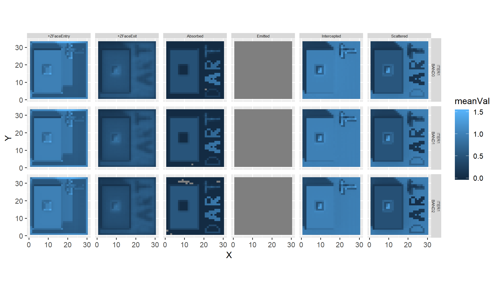

<!-- README.md is generated from README.Rmd. Please edit and run README.Rmd file to regenerate README.md -->

# daRt

<!-- badges: start -->

<!-- badges: end -->

The daRt package provides a very quick and flexible way to import data
that is produced by the Discrete Anisotropic Radiative Transfer (DART)
model. The data in daRt are formatted in a way that facilitates rapid
data analysis.

## Installation

You can install the development version from
[GitHub](https://github.com/) with:

``` r
# install.packages("devtools")
devtools::install_github("willmorrison1/daRt")
```

## Example

Load the package

``` r
library(daRt)
```

Create and modify the “SimulationFilter” object. This object describes
what data you want to extract from a DART output directory structure.

``` r
#define SimulationFilter object - define "directions" as the product
sF <- simulationFilter(product = "directions")

#show the SimulationFilter
sF
#> 'SimulationFilter' object for DART product: directions 
#> 
#> bands:          BAND0 
#> variables:      BRF 
#> iterations:     ITER1, ITERX 
#> variablesRB3D:  Intercepted, Scattered, Emitted, Absorbed, +ZFaceExit, +ZFaceEntry 
#> typeNums:        
#> imageType:      ima, camera 
#> imageNo:

#list the 'setters' and 'accessors'
methods(class = "SimulationFilter")
#>  [1] bands           bands<-         getData         getFiles       
#>  [5] imageFiles      imageNo         imageNo<-       imageType      
#>  [9] imageType<-     iters           iters<-         product        
#> [13] product<-       show            simdir          typeNums       
#> [17] typeNums<-      variables       variables<-     variablesRB3D  
#> [21] variablesRB3D<-
#> see '?methods' for accessing help and source code

#e.g. change the 'bands', then the 'iterations'
bands(sF) <- c("BAND0", "BAND1")
iters(sF) <- "ITER1"
```

Now explore the DART output directory structure. First define the
simulation directory. For this example, ‘simulationDir’ is a relative
directory and is one simulation.

``` r
simulationDir <- "man/data/cesbio"
```

If you install the package using devtools::install\_github then these
DART files will not be available automatically. To use these files, get
them from github manually or use your own ‘cesbio’ simulation (is
shipped with the DART model).

The directory should be the base directory of the simulation. E.g.
within ‘simulationDir there should be the simulation ’input’ and
‘output’ directories.

``` r
list.files(simulationDir)
#> [1] "input"  "output"
```

Now we have the simulation diretory clarified, we continue by defining a
simulationFilter and then explore the files

``` r
#define the SimulationFiler as shown above (i.e. 'sF'), but in one line
sF1 <- simulationFilter(product = "directions", 
                       bands = c("BAND0", "BAND1"), 
                       iters = "ITER1")

#get simulation files based on this newly defined filter
simFiles <- daRt::getFiles(x = simulationDir, sF = sF1)

#show these files are we happy to continue and load the data, or
#do we want to adjust the SimulationFilter? daRt::getFiles is essentially
#a 'dry-run' of the data extraction
files(simFiles)
#>    band variable  iter typeNum                                    fileName
#> 1 BAND0      BRF ITER1         man/data/cesbio/output//BAND0/BRF/ITER1/brf
#> 2 BAND1      BRF ITER1         man/data/cesbio/output//BAND1/BRF/ITER1/brf
#>   simName
#> 1  cesbio
#> 2  cesbio
```

Now extract DART output data using the ‘getData’ method

``` r
#get simulation data
simData <- daRt::getData(x = simulationDir, sF = sF1)
#also can do this using simFiles object
simData_fromFiles <- daRt::getData(x = simFiles)

identical(simData_fromFiles, simData)
#> [1] TRUE
```

Documentation needs updating and finishing from here

``` r
#plot using ggplot2
library(ggplot2)
plotOut <- ggplot(simData@data) +
    geom_point(aes(x = zenith, y = value, colour = azimuth)) +
    facet_wrap(~ band) +
    theme(aspect.ratio = 1)
plot(plotOut)
```


Then alter the SimulationFilter to look at images

``` r
product(sF) <- "images"
simData <- daRt::getData(x = simulationDir, sF = sF)
ggplot(simData@data) + 
    geom_raster(aes(x = x, y = y, fill = value)) +
    facet_grid(band ~ imageNo) +
    theme(aspect.ratio = 1)
```

 Alter
the SimulationFilter again to now look at radiative budget files

``` r
product(sF) <- "rb3D"
simData <- daRt::getData(x = simulationDir, sF = sF)
#> Warning in filesFun(x = x[i], sF = sF): Forcing 'RADIATIVE_BUDGET' variable
#> in 'simulationFilter' variables.
```

The 3D radiative budget data are stored with the X, Y and Z location fo
each cell stored in 3 columns

``` r
head(simData@data)
#>    X Y Z    value variablesRB3D  band  iter typeNum simName
#> 1: 1 1 1 1.008458   Intercepted BAND0 ITER1          cesbio
#> 2: 2 1 1 1.018114   Intercepted BAND0 ITER1          cesbio
#> 3: 3 1 1 1.011255   Intercepted BAND0 ITER1          cesbio
#> 4: 4 1 1 1.017987   Intercepted BAND0 ITER1          cesbio
#> 5: 5 1 1 1.019860   Intercepted BAND0 ITER1          cesbio
#> 6: 6 1 1 1.016943   Intercepted BAND0 ITER1          cesbio
```

Now plot the a slice of the radiative budget data

``` r
ggplot(simData@data) + 
    geom_raster(aes(x = X, y = Y, fill = value)) +
    facet_grid(band + variablesRB3D~ Z) +
    theme(aspect.ratio = 1)
```


That’s a lot of data\! It is important to set the “SimulationFilter” to
match what data you want so that this doesn’t happen. Also, the process
can use a lot of memory when many large files are loaded so try to only
load in the files you need in the first place. The below example uses
the simple “dplyr” approach to work with the data. Here we look at the
lowest horizontal layer of each 3D radiative budget array (i.e. Z = 1)
rather than all layers (above plot) and plot the smaller dataset.

``` r
library(dplyr)
simData_filtered <- simData@data %>%
    dplyr::filter(Z == 1)
#plot again and tweak the plot
ggplot(simData_filtered) + 
    geom_raster(aes(x = X, y = Y, fill = value)) +
    facet_grid(band ~ variablesRB3D) +
    theme(aspect.ratio = 1) +
    theme_bw() +
    theme(panel.spacing = unit(0, "cm"), 
          strip.text = element_text(size = 6, 
                                    margin = margin(0.05, 0.05, 0.05, 0.05, unit = "cm"))) +
    scale_fill_distiller(palette = "Spectral")
```

 All data
are loaded to memory which is problematic when loading many files. In
these cases it is assumed that some processing is to occur on each
product. Load all radiative budget products at once into memory and take
the mean of each horizontal layer.

``` r
sF2 <- simulationFilter(product = "rb3D", 
                       bands = c("BAND0", "BAND1", "BAND2"), 
                       iters = "ITER1", "ITER2", "ILLUDIFF", "ILLUDIR",
                       typeNums = "")
simFiles <- daRt::getFiles(simulationDir, sF = sF2)
#> Warning in filesFun(x = x[i], sF = sF): Forcing 'RADIATIVE_BUDGET' variable
#> in 'simulationFilter' variables.
```

There are three files each with 6 variables - i.e. quite a lot of data

``` r
files(simFiles)
#>    band         variable  iter typeNum
#> 1 BAND0 RADIATIVE_BUDGET ITER1        
#> 2 BAND1 RADIATIVE_BUDGET ITER1        
#> 3 BAND2 RADIATIVE_BUDGET ITER1        
#>                                                                                                                             fileName
#> 1 man/data/cesbio/output//BAND0/RADIATIVE_BUDGET/ITER1/3D_30_33_11_Intercepted_Scattered_Emitted_Absorbed_+ZFaceExit_+ZFaceEntry.bin
#> 2 man/data/cesbio/output//BAND1/RADIATIVE_BUDGET/ITER1/3D_30_33_11_Intercepted_Scattered_Emitted_Absorbed_+ZFaceExit_+ZFaceEntry.bin
#> 3 man/data/cesbio/output//BAND2/RADIATIVE_BUDGET/ITER1/3D_30_33_11_Intercepted_Scattered_Emitted_Absorbed_+ZFaceExit_+ZFaceEntry.bin
#>   simName
#> 1  cesbio
#> 2  cesbio
#> 3  cesbio
```

Load in the data all at once - relatively memory intensive

``` r
simData <- daRt::getData(x = simFiles)
```

With a relatively large array of data

``` r
head(simData@data)
#>    X Y Z    value variablesRB3D  band  iter typeNum simName
#> 1: 1 1 1 1.008458   Intercepted BAND0 ITER1          cesbio
#> 2: 2 1 1 1.018114   Intercepted BAND0 ITER1          cesbio
#> 3: 3 1 1 1.011255   Intercepted BAND0 ITER1          cesbio
#> 4: 4 1 1 1.017987   Intercepted BAND0 ITER1          cesbio
#> 5: 5 1 1 1.019860   Intercepted BAND0 ITER1          cesbio
#> 6: 6 1 1 1.016943   Intercepted BAND0 ITER1          cesbio
dim(simData@data)
#> [1] 196020      9
```

Get the mean of non-zero values across each vertical layer of each
variable, band, etc

``` r
statVals <- simData@data %>%
    dplyr::group_by(X, Y, variablesRB3D, band, iter, typeNum, simName) %>%
    dplyr::summarise(meanVal = mean(value[value != 0], na.rm = TRUE))
#> Warning: The `printer` argument is deprecated as of rlang 0.3.0.
#> This warning is displayed once per session.
```

Then plot these values

``` r
ggplot(statVals) +
    geom_raster(aes(x = X, y = Y, fill = meanVal)) +
    facet_grid(iter + band ~ variablesRB3D) +
    theme(strip.text = element_text(size = 5, margin = margin(0.1, 0.1, 0.1, 0.1))) +
    theme(aspect.ratio = 1)
```

 Do
the same analysis, but iterate over each band and load data for each
band sequentially to save on memory usage

``` r
sF2 <- simulationFilter(product = "rb3D", 
                       bands = c("BAND0", "BAND1", "BAND2"), 
                       iters = "ITER1", "ITER2", "ILLUDIFF", "ILLUDIR",
                       typeNums = "",
                       variables = "RADIATIVE_BUDGET")
allBands <- bands(simData)
allBands
#> [1] "BAND0" "BAND1" "BAND2"
simDataList <- vector(mode = "list", length = length(allBands))
for (i in 1:length(allBands)) {
    bands(sF2) <- allBands[i]
    simFiles <- daRt::getFiles(simulationDir, sF = sF2)
    simDataList[[i]] <- daRt::getData(x = simFiles)
}
```

Now put together the list of data ***wip*** (not giving equal results
yet)

``` r
simDataDF <- dplyr::bind_rows(lapply(simDataList, function(x) x@data))

statVals1 <- simDataDF %>%
    dplyr::group_by(X, Y, variablesRB3D, band, iter, typeNum, simName) %>%
    dplyr::summarise(meanVal = mean(value[value != 0], na.rm = TRUE))
```

Both approaches give the same results

``` r
all.equal(statVals1, statVals)
#> [1] TRUE
```

but by processing in parts, the latter has a smaller memory footprint.
