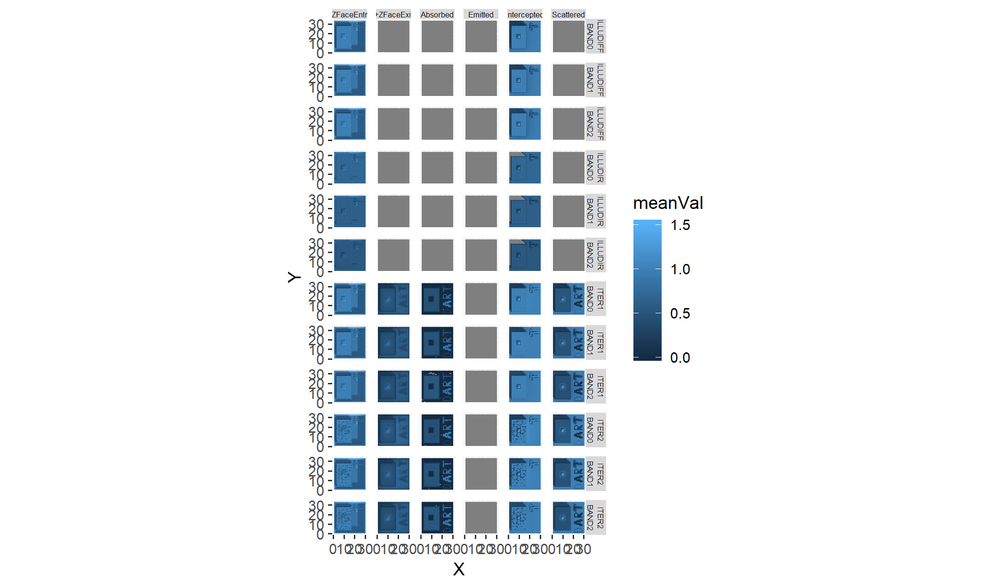

<!-- README.md is generated from README.Rmd. Please edit and run README.Rmd file to regenerate README.md -->
daRt
====

<!-- badges: start -->
<!-- badges: end -->
The daRt package provides a very quick and flexible way to import data that is produced by the Discrete Anisotropic Radiative Transfer (DART) model. The data in daRt are formatted in a way that facilitates rapid data analysis.

Installation
------------

You can install the development version from [GitHub](https://github.com/) with:

``` r
# install.packages("devtools")
devtools::install_github("willmorrison1/daRt")
```

Load the package

``` r
library(daRt)
```

Overview
--------

This section demonstrates the most basic use of daRt to load the "directions" `product` data for the default "cesbio" simulation provided in this respository. Determine the type of files you want to load

``` r
sF <- simulationFilter(product = "directions")
```

Define a simulation directory

``` r
simulationDir <- "man/data/cesbio"
```

Load data for the given simulation using the predetermined file types

``` r
simData <- daRt::getData(x = simulationDir, sF = sF)
```

Use the data in the given "long" format

``` r
DF <- as.data.frame(simData)
head(DF, n = 3)
#> # A tibble: 3 x 8
#> # Groups:   band, iter, typeNum, simName [1]
#>   zenith azimuth value band  variable iter  typeNum simName
#>    <dbl>   <dbl> <dbl> <chr> <chr>    <chr> <chr>   <chr>  
#> 1    0         0 0.646 BAND0 BRF      ITER1 ""      cesbio 
#> 2   22.4      30 0.612 BAND0 BRF      ITER1 ""      cesbio 
#> 3   22.4      90 0.598 BAND0 BRF      ITER1 ""      cesbio
```

### SimulationFilter

The "SimulationFilter" object describes what data you want to extract from a DART output directory structure. Show the current configuration of the `SimulationFilter`

``` r
sF
#> 'SimulationFilter' object for DART product: directions 
#> 
#> bands:          BAND0 
#> variables:      BRF 
#> iterations:     ITER1, ITER2 
#> variablesRB3D:  Intercepted, Scattered, Emitted, Absorbed, +ZFaceExit, +ZFaceEntry 
#> typeNums:        
#> imageType:      ima, camera 
#> imageNo:
```

List the 'setter' and 'accessor' methods available

``` r
methods(class = "SimulationFilter")
#>  [1] bands           bands<-         getData         getFiles       
#>  [5] imageFiles      imageNo         imageNo<-       imageType      
#>  [9] imageType<-     iters           iters<-         product        
#> [13] product<-       show            simdir          typeNums       
#> [17] typeNums<-      variables       variables<-     variablesRB3D  
#> [21] variablesRB3D<-
#> see '?methods' for accessing help and source code
```

Use these methods to edit the `SimulationFilter` object e.g. the `bands` or `iters` (iterations) that you want to load

``` r
bands(sF) <- c("BAND0", "BAND1")
iters(sF) <- "ITER1"
```

### SimulationFiles

The "SimulationFiles" object contains all information on the files that will be loaded, based on the provided `SimulationFilter`. It is used to explore the DART output directory structure. First define the simulation directory. For this example, `simulationDir` is a relative directory (based on the github data provided) and consists of one simulation.

``` r
#define the simulation directory
simulationDir <- "man/data/cesbio"
```

If you install the package using devtools::install\_github then the "cesbio" simulation files will not be available automatically. To use these files, get them from github manually or use your own 'cesbio' simulation which is shipped with the DART model by default.

The simulation directory should be the base directory of the simulation. E.g. within `simulationDir` there should be the simulation 'input' and 'output' directories.

``` r
list.files(simulationDir)
#> [1] "input"  "output"
```

Now we have the simulation directory clarified, explore the files in the simulation that correspond to this filter

``` r
simFiles <- daRt::getFiles(x = simulationDir, sF = sF)
```

Explore the output of this to check we happy to continue and load the data. `getFiles()` is essentially a 'dry-run' of the data extraction

``` r
files(simFiles)
#>    band variable  iter typeNum                                    fileName
#> 1 BAND0      BRF ITER1         man/data/cesbio/output//BAND0/BRF/ITER1/brf
#> 2 BAND1      BRF ITER1         man/data/cesbio/output//BAND1/BRF/ITER1/brf
#>   simName
#> 1  cesbio
#> 2  cesbio
```

### SimulationData

The `SimulationData` object contains all data for the given `SimulationFilter`. Do the following to extract DART output data using the `getData()` method

``` r
simData <- daRt::getData(x = simulationDir, sF = sF)
#also can do this using simFiles object
simData_fromFiles <- daRt::getData(x = simFiles)
identical(simData_fromFiles, simData)
#> [1] TRUE
```

### Simple plotting

By having data in a "long" format, it is easy to perform analysis on the data.

``` r
#plot using ggplot2
library(ggplot2)
plotOut <- ggplot(as.data.frame(simData)) +
    geom_point(aes(x = zenith, y = value, colour = azimuth)) +
    facet_wrap(~ band) +
    theme(aspect.ratio = 1)
plot(plotOut)
```


Further examples
----------------

This section provides further misc examples and guidance for reference.

### SimulationFilter editing

To look at images for `bands` 0, 1 and 2; `iters` (iterations) 1 and 2, and `ima` (images) 5 and 7, create the relevant SimulationFilter then load the data

``` r
#create SimulationFilter
sF <- simulationFilter(product = "images", 
                       bands = c("BAND0", "BAND1", "BAND2"),
                       iters = c("ITER1", "ITER2"),
                       variables = "BRF",
                       imageNo = c(5, 7),
                       imageType = "ima")
#load data - 'nCores' allows parallel processing of files.
#It is useful for access to drives that have optimised paralell I/O.
#here load data using 2 cores.
simData <- daRt::getData(x = simulationDir, sF = sF, nCores = 1)
#simple plot of data
ggplot(as.data.frame(simData)) + 
    geom_raster(aes(x = x, y = y, fill = value)) +
    facet_grid(band ~ imageNo + iter) +
    theme(aspect.ratio = 1)
```


### Radiative budget

Alter the `SimulationFilter` again to now look at files for the radiative budget `product`

``` r
product(sF) <- "rb3D"
simData <- daRt::getData(x = simulationDir, sF = sF)
#> Warning in filesFun(x = x[i], sF = sF): Forcing 'RADIATIVE_BUDGET' variable
#> in 'simulationFilter' variables.
```

The 3D radiative budget data are stored with the X, Y and Z location of each cell, stored in 3 columns

``` r
head(as.data.frame(simData), n = 3)
#> # A tibble: 3 x 9
#> # Groups:   band, iter, typeNum, simName [1]
#>       X     Y     Z value variablesRB3D band  iter  typeNum simName
#>   <int> <int> <int> <dbl> <chr>         <chr> <chr> <chr>   <chr>  
#> 1     1     1     1  1.01 Intercepted   BAND0 ITER1 ""      cesbio 
#> 2     2     1     1  1.02 Intercepted   BAND0 ITER1 ""      cesbio 
#> 3     3     1     1  1.01 Intercepted   BAND0 ITER1 ""      cesbio
```

Plot a horizontal slice of the radiative budget data

``` r
ggplot(as.data.frame(simData)) + 
    geom_raster(aes(x = X, y = Y, fill = value)) +
    facet_grid(band + variablesRB3D~ Z) +
    theme(aspect.ratio = 1)
```

 This outputs lots of data. It's important that `SimulationFilter` matches only the data you actually want.

The below example uses the simple "dplyr" approach to work with this data. Here we look at the lowest horizontal layer of each 3D radiative budget array (i.e. Z = 1) rather than all layers (above plot) and plot the smaller dataset.

``` r
library(dplyr)

simData_filtered <- as.data.frame(simData) %>%
    dplyr::filter(Z == 1)

#plot again and tweak the plot
ggplot(simData_filtered) + 
    geom_raster(aes(x = X, y = Y, fill = value)) +
    facet_grid(band ~ variablesRB3D) +
    theme_bw() +
    theme(panel.spacing = unit(0, "cm"), 
          strip.text = element_text(size = 6, 
                                    margin = margin(0.05, 0.05, 0.05, 0.05, unit = "cm"))) +
    scale_fill_distiller(palette = "Spectral") +
       theme(aspect.ratio = 1)
```


### Memory management

`getData()` loads all data to memory which is problematic when loading many large files (e.g. Radiative Budget). This section demonstrates memory management when loading a relatively large set of files. The files are loaded in two ways: Option 1 uses the default `getData()` to load all data at once, whereas Option 2 offers a solution to process data with a much smaller memory footprint.

#### Option 1: Load data all at once

Load all radiative budget products at once into memory and take the mean of each horizontal layer.

``` r
sF <- simulationFilter(product = "rb3D", 
                       bands = c("BAND0", "BAND1", "BAND2"), 
                       iters = c("ITER1", "ITER2", "ILLUDIFF", "ILLUDIR"),
                       typeNums = "",
                       variables = "RADIATIVE_BUDGET")
simFiles <- daRt::getFiles(simulationDir, sF = sF)
```

There are twelve files each with 6 variables and each as a 3D array - i.e. quite a lot of data

``` r
files(simFiles)
#>     band         variable     iter typeNum
#> 1  BAND0 RADIATIVE_BUDGET    ITER1        
#> 2  BAND0 RADIATIVE_BUDGET    ITER2        
#> 3  BAND0 RADIATIVE_BUDGET ILLUDIFF        
#> 4  BAND0 RADIATIVE_BUDGET  ILLUDIR        
#> 5  BAND1 RADIATIVE_BUDGET    ITER1        
#> 6  BAND1 RADIATIVE_BUDGET    ITER2        
#> 7  BAND1 RADIATIVE_BUDGET ILLUDIFF        
#> 8  BAND1 RADIATIVE_BUDGET  ILLUDIR        
#> 9  BAND2 RADIATIVE_BUDGET    ITER1        
#> 10 BAND2 RADIATIVE_BUDGET    ITER2        
#> 11 BAND2 RADIATIVE_BUDGET ILLUDIFF        
#> 12 BAND2 RADIATIVE_BUDGET  ILLUDIR        
#>                                                                                                                                 fileName
#> 1     man/data/cesbio/output//BAND0/RADIATIVE_BUDGET/ITER1/3D_30_33_11_Intercepted_Scattered_Emitted_Absorbed_+ZFaceExit_+ZFaceEntry.bin
#> 2     man/data/cesbio/output//BAND0/RADIATIVE_BUDGET/ITER2/3D_30_33_11_Intercepted_Scattered_Emitted_Absorbed_+ZFaceExit_+ZFaceEntry.bin
#> 3  man/data/cesbio/output//BAND0/RADIATIVE_BUDGET/ILLUDIFF/3D_30_33_11_Intercepted_Scattered_Emitted_Absorbed_+ZFaceExit_+ZFaceEntry.bin
#> 4   man/data/cesbio/output//BAND0/RADIATIVE_BUDGET/ILLUDIR/3D_30_33_11_Intercepted_Scattered_Emitted_Absorbed_+ZFaceExit_+ZFaceEntry.bin
#> 5     man/data/cesbio/output//BAND1/RADIATIVE_BUDGET/ITER1/3D_30_33_11_Intercepted_Scattered_Emitted_Absorbed_+ZFaceExit_+ZFaceEntry.bin
#> 6     man/data/cesbio/output//BAND1/RADIATIVE_BUDGET/ITER2/3D_30_33_11_Intercepted_Scattered_Emitted_Absorbed_+ZFaceExit_+ZFaceEntry.bin
#> 7  man/data/cesbio/output//BAND1/RADIATIVE_BUDGET/ILLUDIFF/3D_30_33_11_Intercepted_Scattered_Emitted_Absorbed_+ZFaceExit_+ZFaceEntry.bin
#> 8   man/data/cesbio/output//BAND1/RADIATIVE_BUDGET/ILLUDIR/3D_30_33_11_Intercepted_Scattered_Emitted_Absorbed_+ZFaceExit_+ZFaceEntry.bin
#> 9     man/data/cesbio/output//BAND2/RADIATIVE_BUDGET/ITER1/3D_30_33_11_Intercepted_Scattered_Emitted_Absorbed_+ZFaceExit_+ZFaceEntry.bin
#> 10    man/data/cesbio/output//BAND2/RADIATIVE_BUDGET/ITER2/3D_30_33_11_Intercepted_Scattered_Emitted_Absorbed_+ZFaceExit_+ZFaceEntry.bin
#> 11 man/data/cesbio/output//BAND2/RADIATIVE_BUDGET/ILLUDIFF/3D_30_33_11_Intercepted_Scattered_Emitted_Absorbed_+ZFaceExit_+ZFaceEntry.bin
#> 12  man/data/cesbio/output//BAND2/RADIATIVE_BUDGET/ILLUDIR/3D_30_33_11_Intercepted_Scattered_Emitted_Absorbed_+ZFaceExit_+ZFaceEntry.bin
#>    simName
#> 1   cesbio
#> 2   cesbio
#> 3   cesbio
#> 4   cesbio
#> 5   cesbio
#> 6   cesbio
#> 7   cesbio
#> 8   cesbio
#> 9   cesbio
#> 10  cesbio
#> 11  cesbio
#> 12  cesbio
```

Load in the data all at once. It is relatively memory intensive

``` r
simData <- daRt::getData(x = simFiles, nCores = 1)
```

and gives a relatively large array of data

``` r
DFdata <- as.data.frame(simData)
head(DFdata, n = 3)
#> # A tibble: 3 x 9
#> # Groups:   band, iter, typeNum, simName [1]
#>       X     Y     Z value variablesRB3D band  iter  typeNum simName
#>   <int> <int> <int> <dbl> <chr>         <chr> <chr> <chr>   <chr>  
#> 1     1     1     1  1.01 Intercepted   BAND0 ITER1 ""      cesbio 
#> 2     2     1     1  1.02 Intercepted   BAND0 ITER1 ""      cesbio 
#> 3     3     1     1  1.01 Intercepted   BAND0 ITER1 ""      cesbio
dim(DFdata)
#> [1] 784080      9
```

Do some analysis on the data. Get the mean of non-zero values across each vertical layer of each variable, band, etc

``` r
statVals <- DFdata %>%
    dplyr::group_by(X, Y, variablesRB3D, add = TRUE) %>%
    dplyr::summarise(meanVal = mean(value[value != 0], na.rm = TRUE))
```

Then plot these values

``` r
ggplot(statVals) +
    geom_raster(aes(x = X, y = Y, fill = meanVal)) +
    facet_grid(iter + band ~ variablesRB3D) +
    theme(strip.text = element_text(size = 5, margin = margin(0.1, 0.1, 0.1, 0.1))) +
    theme(aspect.ratio = 1)
```



#### Option 2: Load data in sections and process each section

Do Option 1 analysis but with data processed for each band separately to save on memory usage.

``` r
sF <- simulationFilter(product = "rb3D", 
                       bands = c("BAND0", "BAND1", "BAND2"), 
                       iters = "ITER1", "ITER2", "ILLUDIFF", "ILLUDIR",
                       typeNums = "",
                       variables = "RADIATIVE_BUDGET")
allBands <- bands(simData)
allBands
#> [1] "BAND0" "BAND1" "BAND2"
simDataList <- vector(mode = "list", length = length(allBands))
for (i in 1:length(allBands)) {
    bands(sF) <- allBands[i]
    simDataPiece  <- daRt::getData(x = simulationDir, sF = sF)
    simDataList[[i]] <- as.data.frame(simDataPiece) %>%
        dplyr::group_by(X, Y, variablesRB3D, add = TRUE) %>%
        dplyr::summarise(meanVal = mean(value[value != 0], na.rm = TRUE))
}
```

Now put together the list of data. As each list element is a summary of the raw data, it has a much smaller memory footprint. As the summary was performed on one band at a time, the amount of data loaded at once is less than if getFiles() was executed for all bands at once (Option 1). By loading one band at a time as opposed to all three at once, the memory footprint is around 1/3 comparsed to Option 1.

``` r
simDataDF <- dplyr::bind_rows(simDataList)

statVals1 <- simDataDF
```

Both approaches give the same results

``` r
all.equal(statVals, statVals1)
#> [1] "Different number of rows"
```

but by processing in parts, the latter (Option 2) - produced by 'statVals1' - has a smaller memory footprint as the stats are calculated for each band separately. When inter-band stats are required, the example can be adapted to iterate over e.g. 'iters' or 'variablesRB3D'.
