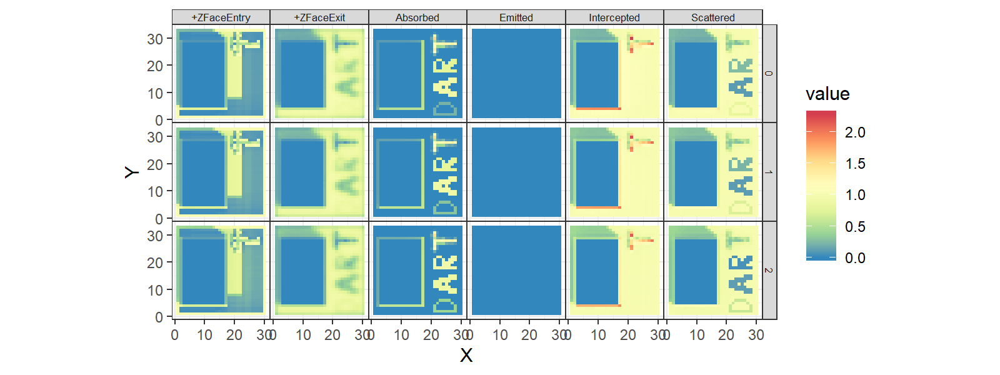

daRt
================

  - [Installation](#installation)
  - [Overview](#overview)
      - [Define data to load:
        SimulationFilter](#define-data-to-load-simulationfilter)
      - [Browse files: SimulationFiles](#browse-files-simulationfiles)
      - [Load data: SimulationData](#load-data-simulationdata)
      - [Analysis: as.data.frame()](#analysis-as.data.frame)
  - [Expanded examples](#expanded-examples)
      - [Defining data to load: SimulationFilter for
        images](#defining-data-to-load-simulationfilter-for-images)
      - [Working with output data: radiative budget](#RB)
  - [Miscellaneous](#miscellaneous)
      - [Memory management: tips](#memory-management-tips)
      - [Radiative budget files:
        compression](#radiative-budget-files-compression)
      - [Unwanted files: deletion](#unwanted-files-deletion)
      - [Parallelisation issues](#parallelisation-issues)

<!-- README.md is generated from README.Rmd. Please edit and run README.Rmd file to regenerate README.md -->

<!-- badges: start -->

<!-- badges: end -->

The daRt package provides a very quick and flexible way to import data
that is produced by the Discrete Anisotropic Radiative Transfer (DART)
model. The data in daRt are formatted in a way that facilitates rapid
data analysis. Formal documentation is available in the pdf manual.

# Installation

You can install the development version from
[GitHub](https://github.com/) with:

``` r
# install.packages("remotes")
# devtools::install_github doesn't like my github package dependencies 
remotes::install_github("willmorrison1/daRt")
```

Load the package

``` r
library(daRt)
#> Warning: package 'dplyr' was built under R version 3.5.3
#> Warning: package 'stringr' was built under R version 3.5.3
#> Warning: package 'tibble' was built under R version 3.5.3
#> Warning: package 'data.table' was built under R version 3.5.3
#> Warning: package 'foreach' was built under R version 3.5.3
#> Warning: package 'doParallel' was built under R version 3.5.3
#> Warning: package 'iterators' was built under R version 3.5.3
#> Warning: package 'shadowtext' was built under R version 3.5.3
#> Warning: package 'fields' was built under R version 3.5.3
#> Warning: package 'spam' was built under R version 3.5.3
#> Warning: package 'dotCall64' was built under R version 3.5.3
#> Warning: package 'maps' was built under R version 3.5.3
#> Warning: package 'ncdf4' was built under R version 3.5.3
#> Warning: package 'chron' was built under R version 3.5.3
#> Warning: package 'xml2' was built under R version 3.5.3
#> Warning: package 'tidyr' was built under R version 3.5.3
#> Warning: package 'raster' was built under R version 3.5.3
```

# Overview

This section demonstrates the most basic use of daRt to load the
“directions” data `product` for the default “cesbio” simulation
provided in this respository.

Define a simulation directory

``` r
simulationDir <- "man/data/cesbio"
```

**`simulationFilter()`** determines the type of files you want to load
(here with defaults).

``` r
sF <- daRt::simulationFilter(product = "directions")
```

**`getData()`** loads data for the given simulation using the
predetermined file type(s).

``` r
simData <- daRt::getData(x = simulationDir, sF = sF)
```

**`as.data.frame()`** releases the data object as a “long” format data
frame.

``` r
DF <- as.data.frame(simData)
head(DF, n = 3)
#> # A tibble: 3 x 8
#> # Groups:   band, iter, typeNum, simName [1]
#>   zenith azimuth value  band variable iter  typeNum simName
#>    <dbl>   <dbl> <dbl> <int> <chr>    <chr> <chr>   <chr>  
#> 1    0         0 0.646     0 BRF      ITER1 ""      cesbio 
#> 2   22.4      30 0.612     0 BRF      ITER1 ""      cesbio 
#> 3   22.4      90 0.598     0 BRF      ITER1 ""      cesbio
```

## Define data to load: SimulationFilter

The ‘SimulationFilter’ object describes what data you want to extract
from a DART output directory structure. Show the current configuration
of the `SimulationFilter`

``` r
sF
#> 'SimulationFilter' object for DART product: directions 
#> 
#> bands:          0, 1 
#> variables:      BRF 
#> iterations:     ITER1, ITER2 
#> variablesRB3D:  Intercepted, Scattered, Emitted, Absorbed, +ZFaceExit, +ZFaceEntry 
#> typeNums:        
#> imageTypes:      ima, camera 
#> imageNums:
```

List the ‘setter’ and ‘accessor’ methods available

``` r
methods(class = "SimulationFilter")
#>  [1] bands              bands<-            getData            getFiles          
#>  [5] imageFiles         imageNums          imageNums<-        imageTypes        
#>  [9] imageTypes<-       iters              iters<-            product           
#> [13] product<-          show               simulationFilter<- subDir            
#> [17] typeNums           typeNums<-         variables          variables<-       
#> [21] variablesRB3D      variablesRB3D<-   
#> see '?methods' for accessing help and source code
```

Use these methods to edit the `SimulationFilter` object e.g. the `bands`
or `iters` (iterations) that you want to load

``` r
bands(sF) <- 0:2
iters(sF) <- "ITER3"
```

## Browse files: SimulationFiles

The ‘SimulationFiles’ object contains all information on the files that
will be loaded, based on the provided `SimulationFilter`. It is used to
explore the DART output directory structure. First define the simulation
directory. For this example, `simulationDir` is a relative directory
(based on the github data provided) and consists of one simulation.

``` r
#define the simulation directory
simulationDir <- "man/data/cesbio"
```

If you install the package using remotes::install\_github then the
“cesbio” simulation files will not be available automatically. To use
these files, get them from github manually or use your own ‘cesbio’
simulation which is shipped with the DART model by default.

The simulation directory should be the base directory of the simulation.
E.g. within `simulationDir` there should be the simulation ‘input’ and
‘output’ directories.

``` r
list.files(simulationDir)
#> [1] "input"  "output"
```

Now we have the simulation directory clarified, explore the files in the
simulation that correspond to this filter

``` r
simFiles <- daRt::getFiles(x = simulationDir, sF = sF)
```

Explore the output of this to check we happy to continue and load the
data. `getFiles()` is essentially a ‘dry-run’ of the data extraction

``` r
dataFiles <- fileName(simFiles)
all(file.exists(dataFiles))
#> [1] TRUE
```

## Load data: SimulationData

The `SimulationData` object contains all data for the given
`SimulationFilter`. Do the following to extract DART output data using
the `getData()` method

``` r
simData <- daRt::getData(x = simulationDir, sF = sF)
#also can do this using simFiles object
simData_fromFiles <- daRt::getData(x = simFiles)
identical(simData_fromFiles, simData)
#> [1] TRUE
```

## Analysis: as.data.frame()

By having data in a “long” format, it is easy to perform analysis on the
data. Once you are ready to use the data, retrieve it using
`as.data.frame()`.

``` r
#plot using ggplot2
library(ggplot2)
DFdata <- as.data.frame(simData)
plotOut <- ggplot(DFdata) +
    geom_point(aes(x = zenith, y = value, colour = azimuth)) +
    facet_wrap(~ band) +
    theme(aspect.ratio = 1)
plot(plotOut)
```


# Expanded examples

This section provides further examples of package use.

## Defining data to load: SimulationFilter for images

To look at images for `bands` 0, 1 and 2; `iters` (iterations) 1 and 2,
and `imageNums` (image numbers) 5 and 7, create the relevant
SimulationFilter then load the data

``` r
#create SimulationFilter
sF <- daRt::simulationFilter(product = "images", 
                       bands = as.integer(0:2),
                       iters = c("ITER1", "ITER2"),
                       variables = "BRF",
                       imageNums = as.integer(c(5, 7)),
                       imageTypes = "ima") 
#load data - 'nCores' allows parallel processing of files.
#It is useful for access to drives that have optimised paralell I/O.
#here load data using 2 cores.
simData <- daRt::getData(x = simulationDir, sF = sF, nCores = 2)
#simple plot of data
ggplot(as.data.frame(simData)) + 
    geom_raster(aes(x = x, y = y, fill = value)) +
    facet_grid(band ~ imageNum + iter) +
    theme(aspect.ratio = 1) 
```


## Working with output data: radiative budget

Alter the `SimulationFilter` again to now look at files for the
radiative budget `product`.

``` r
product(sF) <- "rb3D"
simData <- daRt::getData(x = simulationDir, sF = sF, nCores = 2)
#> Warning in filesFun(x = x[i], sF = sF): Product is 'rb3D'. Forcing
#> 'RADIATIVE_BUDGET' variable in 'simulationFilter' variables.
```

The 3D radiative budget data are stored with the X, Y and Z location of
each cell (conforming to DART coordinate system i.e. "the part of the
scene that horizontally is ‘top left’ and vertically is at the bottom
is: X = 1, Y = 1, Z = 1), stored in 3 columns.

``` r
head(as.data.frame(simData), n = 3)
#> # A tibble: 3 x 9
#> # Groups:   band, iter, typeNum, simName [1]
#>       X     Y     Z value variableRB3D  band iter  typeNum simName
#>   <int> <int> <int> <dbl> <chr>        <int> <chr> <chr>   <chr>  
#> 1     1     1     1  1.01 Intercepted      0 ITER1 ""      cesbio 
#> 2     2     1     1  1.02 Intercepted      0 ITER1 ""      cesbio 
#> 3     3     1     1  1.01 Intercepted      0 ITER1 ""      cesbio
```

The below example uses “dplyr” to work with this data. Here we look at
the lowest horizontal layer of each 3D radiative budget array (i.e. Z =
1).

``` r
library(dplyr)

#filter lowest horizontal cross section of the radiative budget
simData_filtered <- as.data.frame(simData) %>%
    dplyr::filter(Z == 1)

ggplot(simData_filtered) + 
    geom_raster(aes(x = X, y = Y, fill = value)) +
    facet_grid(band ~ variableRB3D) +
    theme_bw() +
    theme(panel.spacing = unit(0, "cm"), 
          strip.text = element_text(size = 6, 
                                    margin = margin(0.05, 0.05, 0.05, 0.05, unit = "cm"))) +
    scale_fill_distiller(palette = "Spectral") +
       theme(aspect.ratio = 1)
```



# Miscellaneous

## Memory management: tips

Loading many files/variables may require memory management. `getData()`
loads all requested data to memory which can be problematic for large
files (e.g. Radiative Budget). It is assumed that the user will perform
some analysis on subsets of the raw data in a way that reduces the
overall memory footprint. To demonstrate memory management, files in
this section are loaded in two different scenarios: scenario 1 uses the
default `getData()` to load and then analyse all data at once. Scenario
2 loads and analyses the data in pieces, which has a much smaller memory
footprint (but may be slower). Both scenarios give the same result.

### Scenario 1: Load data all at once

Load all radiative budget products at once into memory and take the mean
of each horizontal layer.

``` r
sF <- daRt::simulationFilter(product = "rb3D", 
                       bands = as.integer(0:2), 
                       iters = c("ITER1", "ITER2", "ILLUDIFF", "ILLUDIR"),
                       typeNums = "",
                       variables = "RADIATIVE_BUDGET")
simFiles <- daRt::getFiles(simulationDir, sF = sF)
```

There are twelve files each with 6 variables and each as a 3D array -
i.e. quite a lot of data. Load in the data all at once.

``` r
simData <- daRt::getData(x = simFiles, nCores = 2)
```

and gives a relatively large array of data

``` r
DFdata <- as.data.frame(simData)
head(DFdata, n = 3)
#> # A tibble: 3 x 9
#> # Groups:   band, iter, typeNum, simName [1]
#>       X     Y     Z value variableRB3D  band iter  typeNum simName
#>   <int> <int> <int> <dbl> <chr>        <int> <chr> <chr>   <chr>  
#> 1     1     1     1  1.01 Intercepted      0 ITER1 ""      cesbio 
#> 2     2     1     1  1.02 Intercepted      0 ITER1 ""      cesbio 
#> 3     3     1     1  1.01 Intercepted      0 ITER1 ""      cesbio
dim(DFdata)
#> [1] 784080      9
```

Do some analysis on the data. Get the mean of non-zero values across
each vertical layer of each `variablesRB3D`, `bands`, `iters` (already
grouped) according to the above column names

``` r
statVals <- DFdata %>%
    dplyr::group_by(X, Y, variableRB3D, add = TRUE) %>%
    dplyr::summarise(meanVal = mean(value[value != 0], na.rm = TRUE))
```

### Scenario 2: Load data in sections and process each section

Do ‘scenario 1’ analysis but with data processed for each band
separately to save on memory usage.

``` r
sF <- daRt::simulationFilter(product = "rb3D", 
                       bands = as.integer(0:2), 
                       iters = c("ITER1", "ITER2", "ILLUDIFF", "ILLUDIR"),
                       typeNums = "",
                       variables = "RADIATIVE_BUDGET")
allBands <- bands(simData)
allBands
#> [1] 0 1 2
simDataList <- vector(mode = "list", length = length(allBands))
for (i in 1:length(allBands)) {
    bands(sF) <- allBands[i]
    simDataPiece  <- daRt::getData(x = simulationDir, sF = sF, nCores = 2)
    simDataList[[i]] <- as.data.frame(simDataPiece) %>%
        dplyr::group_by(X, Y, variableRB3D, add = TRUE) %>%
        dplyr::summarise(meanVal = mean(value[value != 0], na.rm = TRUE))
}
```

Now put together the list of data. As each list element is a summary of
the raw data, it has a much smaller memory footprint. As the summary was
performed on one band at a time, the amount of data loaded at once is
less than if `getData()` was executed for all bands at once (scenario
1). By loading one band at a time as opposed to all three at once, the
memory footprint is around 1/3 of scenario 1.

``` r
simDataDF <- dplyr::bind_rows(simDataList)

statVals1 <- simDataDF
```

Both scenarios give the same results

``` r
all.equal(statVals, statVals1)
#> [1] TRUE
```

but by processing in parts, the latter (scenario 2) - produced by
‘statVals1’ - has a smaller memory footprint as the stats are
calculated for each band separately. When inter-band stats are required,
the example can be adapted to iterate over e.g. `iters` or
`variablesRB3D`.

## Radiative budget files: compression

DART radiative budget files are raw binary and can get very large.
`rb3DtoNc` converts .bin to NetCDF (.nc) format, which gives smaller
files sizes and can be compressed.

Get some DART radiative budget binary data (the default data)

``` r
simulationDir <- "man/data/cesbio"
sF <- daRt::simulationFilter(product = "rb3D",
                       bands = as.integer(1), 
                       iters = "ITER1",
                       typeNums = "",
                       variables = "RADIATIVE_BUDGET")
simFiles_bin <- daRt::getFiles(simulationDir, sF = sF)
simData_bin <- as.data.frame(daRt::getData(simFiles_bin, nCores = 2))
#get the file size - for later comparison
fileSize_bin <- file.size(fileName(simFiles_bin))
```

Convert the .bin data to .nc. The .bin file will be deleted by
`rb3DtoNc`.

``` r
simFiles_nc <- daRt::rb3DtoNc(simFiles_bin)
simData_nc <- as.data.frame(daRt::getData(simFiles_nc, nCores = 2))
```

There are some very minor differences in the two products - likely due
to the ncdf compression algorithm and/or rounding.

``` r
max(abs(simData_nc$value - simData_bin$value))
#> [1] 9.187445e-08
```

The new .nc file is much smaller:

``` r
fileSize_nc <- file.size(fileName(simFiles_nc))
fileSize_nc / fileSize_bin
#> [1] 0.127663
```

and is much faster to read. It can also be read by third party NetCDF
browsers e.g. ncview.

## Unwanted files: deletion

DART can output many unwanted files. Use `deleteFiles()` to delete files
based on a provided `SimulationFiles` object. Here delete all
`directions` files from `iters` 1 and `bands` 1.

Define the file for deletion

``` r
sF <- daRt::simulationFilter(product = "directions", 
                       bands = 1L, 
                       iters = "ITER1")
filesToDelete <- daRt::getFiles(x = simulationDir, sF = sF)
```

then delete the file, where `deleteSimulationFiles` parameter makes the
user sure to know that they are deleting output data\!

``` r
deleteFiles(x = filesToDelete, deleteSimulationFiles = TRUE)
#> NULL
```

## Parallelisation issues

Under windows especially, there are some issues with paralellisation.
When running `getData()` you may get “invalid connection” error. In this
case you will always need to run with nCores \> 1 e.g. `getData(...,
nCores = 2)`.
